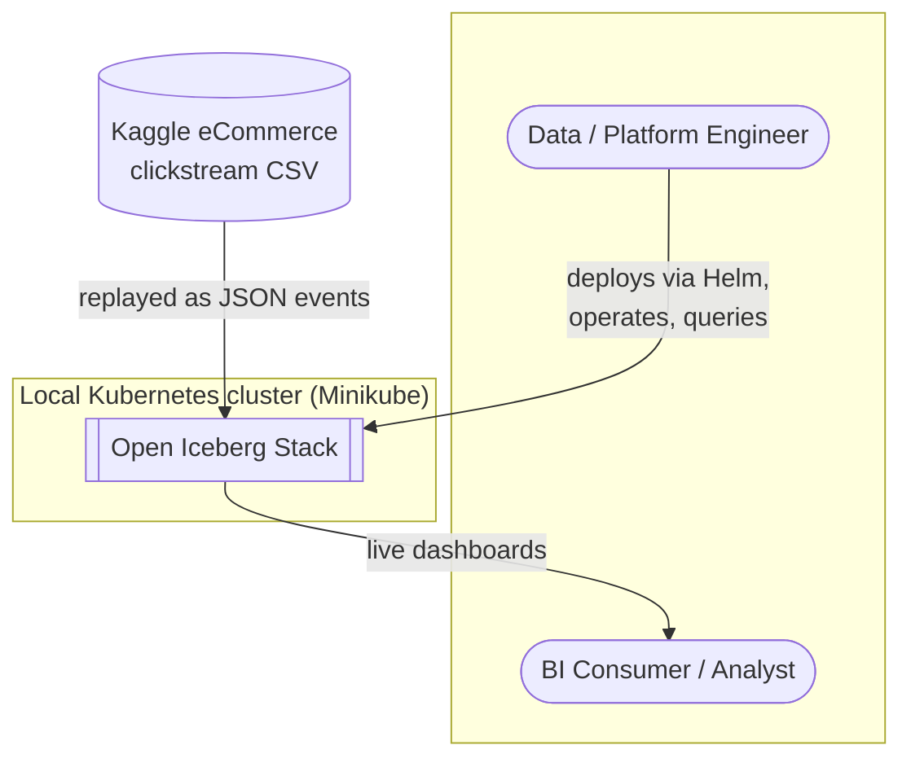
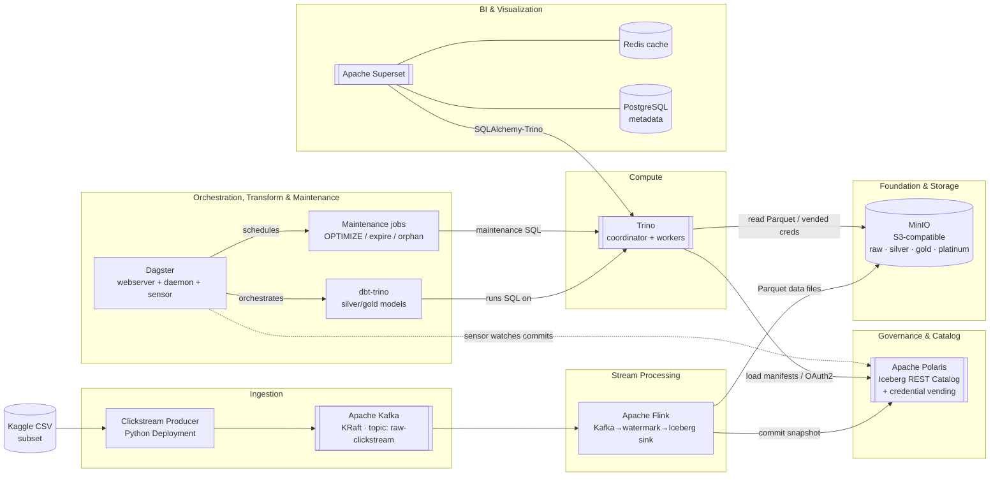
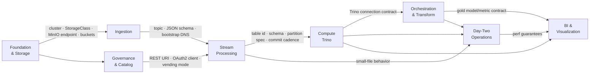

# 01 — System Context & Component Architecture

How the eight layers connect, and where data and control signals flow between
them. This is the "container diagram" for the whole lakehouse — every box is a
deployable component running in the local Kubernetes cluster (except the human
actors and the source dataset).

Component-internal detail for each layer lives in [`../lld/`](../lld/).

## System context

## Component architecture

Data plane flows **left → right** (ingest → store → serve). The catalog and
orchestrator sit across the middle as the shared control plane.

### Reading the diagram

- **The only writer of raw data is Flink.** It writes Parquet to MinIO and
  commits the metadata swap to Polaris on every successful checkpoint. Nothing
  else writes the raw table.
- **Trino is the universal read/execute engine.** dbt (transforms), Superset
  (BI), and the maintenance jobs *all* run their SQL through Trino — none of them
  talk to MinIO or Polaris directly for table data.
- **Polaris is the single source of truth for table state.** Every engine
  resolves "what is the current snapshot / where are the files" through the REST
  catalog, and receives scoped MinIO credentials from it (see
  [04 — Governance & Security](04-governance-and-security.md)).
- **Dagster is the control plane for transforms and maintenance.** Its sensor
  keys off Iceberg commits (the checkpoint cadence from Flink) to trigger dbt;
  its schedules drive the day-two maintenance SQL.

## Control-plane vs data-plane responsibilities

| Component | Data plane | Control plane |
| :--- | :--- | :--- |
| Kafka | carries raw events | — |
| Flink | writes Parquet + Iceberg data files | commits snapshots to Polaris |
| MinIO | stores all Parquet + metadata objects | — |
| Polaris | — | catalog state, RBAC, credential vending |
| Trino | reads/writes table data on behalf of engines | — |
| Dagster | — | sensor triggers + maintenance schedules |
| dbt | issues transform SQL (via Trino) | model dependency graph |
| Superset | reads gold tables (via Trino) | dashboard/dataset definitions |

## Layer contracts

Each layer depends on a written contract published by the layers beneath it.
These are the real "interfaces" of the architecture — each one is specified in
full in the corresponding [low-level design](../lld/):

Read an edge as "publishes to": the foundation layer publishes a cluster and
bucket set that ingestion consumes; the catalog publishes a REST URI and vending
mode that stream processing consumes, and so on. A layer may only depend on
contracts, never on another layer's internals.
