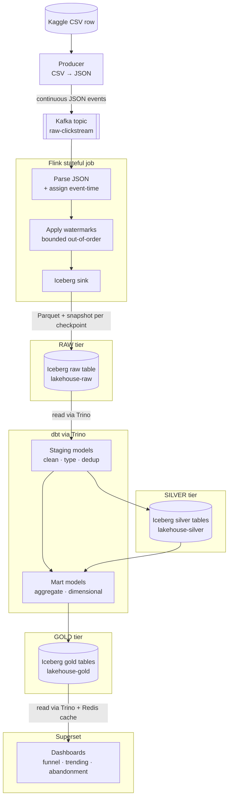
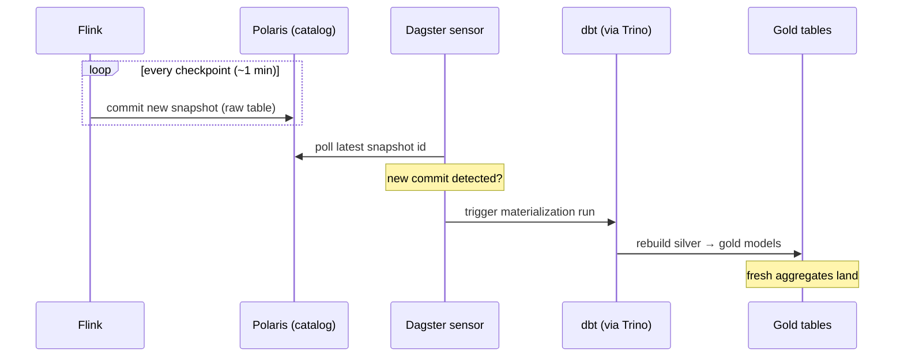
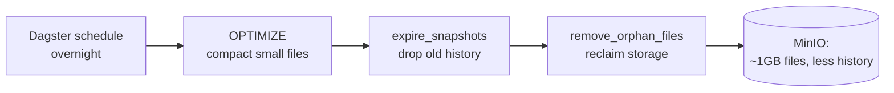

# 02 — End-to-End Data Flow

How a single clickstream event travels from a CSV row to a pixel on a dashboard,
and how the data is progressively refined across the medallion tiers.

## The medallion tiers

Data is refined in stages, each tier landing as Iceberg tables in its own MinIO
bucket:

| Tier | Bucket | Owner | Contents |
| :--- | :--- | :--- | :--- |
| **Raw** | `lakehouse-raw` | Flink | Append-only clickstream events, as ingested |
| **Silver** | `lakehouse-silver` | dbt staging | Cleansed / typed / deduplicated events |
| **Gold** | `lakehouse-gold` | dbt marts | Business aggregates (funnels, cart-abandonment, trending products) |
| **Platinum** | `lakehouse-platinum` | *reserved* | Highly-curated / serving-optimized aggregates (future) |

## End-to-end flow

## The self-driving trigger loop

The pipeline advances **without a scheduler polling on a fixed clock** — it is
event-driven off Iceberg commits:

## Maintenance overlay

Streaming writes create thousands of tiny Parquet files and an ever-growing
snapshot history. Scheduled Dagster jobs run maintenance SQL through Trino to
keep the tables performant — critically, **safe against Flink writing
concurrently**:

- **Order matters:** compact → expire snapshots → remove orphans.
- **Retention must exceed the in-flight write window** so a concurrent Flink
  commit is never treated as orphaned.
- Compaction targets **closed partitions**, never the hot one Flink is writing.

See [LLD 07](../lld/07-day-two-operations.md) for the safety model and SQL.

## Freshness vs. performance

The dashboard is both **live** (new events appear within the refresh window) and
**sub-second** (cached). Redis caching sits between Superset and Trino; the
auto-refresh window is tuned so cache TTL is short enough to reflect new gold
data but long enough to keep repeated loads fast.

See [LLD 08](../lld/08-bi-visualization.md) for how the two are reconciled.
