# 03 — Kubernetes Deployment Topology

What actually runs in the cluster: Helm releases, workloads, services, and
persistent volumes — and the in-cluster DNS names downstream components use to
find each other.

> All components run inside a single local **Minikube** cluster. External access
> is via `kubectl port-forward`; in-cluster traffic uses stable service DNS of
> the form `<svc>.<namespace>.svc.cluster.local:<port>`.

## Deployment view

```mermaid
flowchart TB
    subgraph host["Developer host"]
        helm[Helm CLI]
        kubectl[kubectl port-forward]
        cli[Trino CLI / AWS CLI / boto3]
    end

    subgraph cluster["Minikube cluster"]
        subgraph nsStorage["ns: storage"]
            minioSvc[[Service: minio :9000 / :9001]]
            minioPod[MinIO pod]
            minioPvc[(PVC 10Gi)]
            minioSvc --- minioPod --- minioPvc
        end

        subgraph nsIngest["ns: ingestion"]
            kafkaSvc[[Service: kafka :9092]]
            kafkaPod[Kafka KRaft pod]
            kafkaPvc[(PVC)]
            prodPod[Producer Deployment]
            kafkaSvc --- kafkaPod --- kafkaPvc
            prodPod --> kafkaSvc
        end

        subgraph nsCatalog["ns: catalog"]
            polSvc[[Service: polaris :8181]]
            polPod[Polaris pod]
            polDb[(Metastore<br/>Postgres/PVC)]
            polSvc --- polPod --- polDb
        end

        subgraph nsProcess["ns: processing"]
            flinkOp[Flink K8s Operator]
            flinkDep[FlinkDeployment CR<br/>JobManager + TaskManagers]
            flinkCkpt[(Checkpoints → MinIO)]
            flinkOp -->|manages| flinkDep
            flinkDep -.-> flinkCkpt
        end

        subgraph nsCompute["ns: compute"]
            trinoSvc[[Service: trino :8080]]
            trinoCoord[Trino coordinator]
            trinoWork[Trino workers]
            trinoSvc --- trinoCoord --- trinoWork
        end

        subgraph nsOrch["ns: orchestration"]
            dagWeb[Dagster webserver :3000]
            dagDaemon[Dagster daemon]
            dagCode[dbt code location]
            dagWeb --- dagDaemon --- dagCode
        end

        subgraph nsBi["ns: bi"]
            supSvc[[Service: superset :8088]]
            supPod[Superset pod]
            redisPod[Redis]
            pgPod[(PostgreSQL + PVC)]
            supSvc --- supPod --- redisPod
            supPod --- pgPod
        end
    end

    helm -->|installs releases| cluster
    kubectl -.-> minioSvc
    kubectl -.-> trinoSvc
    kubectl -.-> dagWeb
    kubectl -.-> supSvc
    cli -.-> trinoSvc
```

## Helm releases & source folders

Each layer owns a `deploy/` subfolder of committed Helm values / manifests:

| Release | Chart | `deploy/` folder | Namespace (convention) |
| :--- | :--- | :--- | :--- |
| *(cluster baseline)* | — | `deploy/cluster/` | — |
| MinIO | MinIO Helm chart | `deploy/storage/` | `storage` |
| Kafka | Kafka (KRaft) chart | `deploy/ingestion/` | `ingestion` |
| Polaris | Polaris deploy values | `deploy/catalog/` | `catalog` |
| Flink Operator + Deployment | Flink K8s Operator | `deploy/processing/` | `processing` |
| Trino | Trino Helm chart | `deploy/query/` | `compute` |
| Dagster | Dagster Helm chart | `deploy/orchestration/` | `orchestration` |
| Maintenance schedules | *(Dagster jobs)* | `deploy/maintenance/` | `orchestration` |
| Superset + Redis + Postgres | Superset Helm chart | `deploy/bi/` | `bi` |

> `deploy/cluster/` holds the Minikube/StorageClass baseline rather than a Helm
> release. Folder names and namespace names are independent — Trino's values live
> in `deploy/query/` but the workload runs in the `compute` namespace.

> Namespaces follow the per-layer convention established by the foundation
> layer's tooling baseline. Downstream configs reference services by their
> in-cluster DNS regardless of namespace naming.

## In-cluster service endpoints (the "wiring contract")

These are the addresses components use to find each other — the backbone of
every layer contract:

| Service | In-cluster DNS (shape) | Port | Consumed by |
| :--- | :--- | :--- | :--- |
| MinIO S3 API | `minio.<ns>.svc.cluster.local` | 9000 | Polaris, Flink, Trino |
| MinIO console | `minio.<ns>.svc.cluster.local` | 9001 | operator (port-forward) |
| Kafka bootstrap | `kafka.<ns>.svc.cluster.local` | 9092 | Producer, Flink |
| Polaris REST catalog | `polaris.<ns>.svc.cluster.local` | 8181 | Flink, Trino, Dagster sensor |
| Trino coordinator | `trino.<ns>.svc.cluster.local` | 8080 | dbt, Superset, maintenance jobs, CLI |
| Dagster webserver | `dagster.<ns>.svc.cluster.local` | 3000 | operator (port-forward) |
| Superset | `superset.<ns>.svc.cluster.local` | 8088 | analysts (port-forward) |

> **Path-style S3 access is required** everywhere MinIO is addressed
> (`s3.path-style-access=true`) — MinIO does not support virtual-hosted-style
> bucket addressing by default.

## Persistence

| Workload | Persisted state | Backed by |
| :--- | :--- | :--- |
| MinIO | all Parquet + Iceberg metadata objects | PVC (lean 10Gi local profile) |
| Kafka | topic log segments | PVC |
| Polaris | catalog metastore (namespaces, tables, grants) | Postgres/PVC |
| Flink | checkpoints + savepoints | MinIO (S3 state backend) |
| Superset/Postgres | dashboards, datasets, users | PVC |
| Redis | ephemeral query cache | none (cache) |

Everything data-bearing is backed by a PVC (or MinIO) so state survives pod
restarts.
