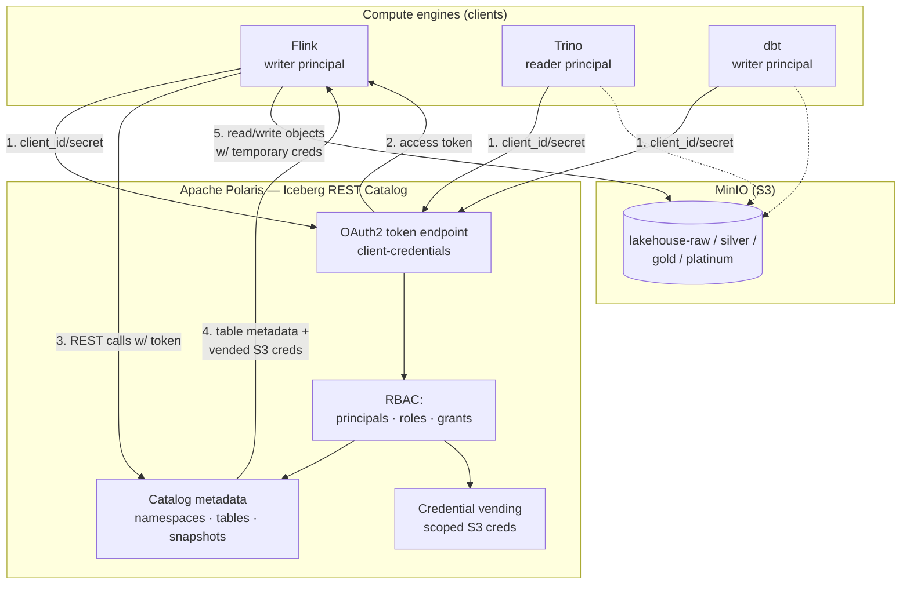
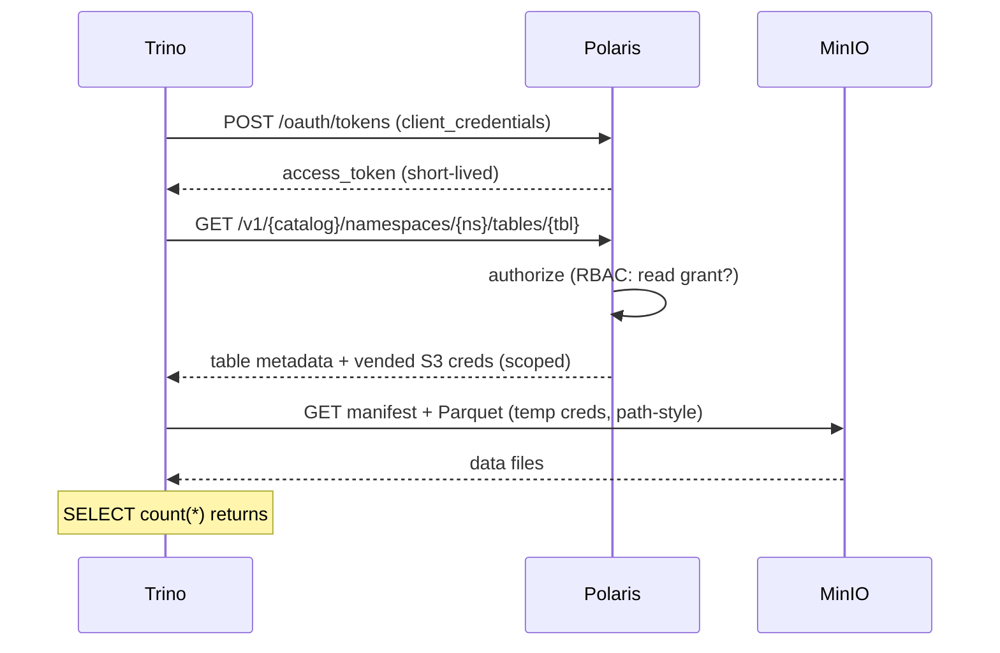
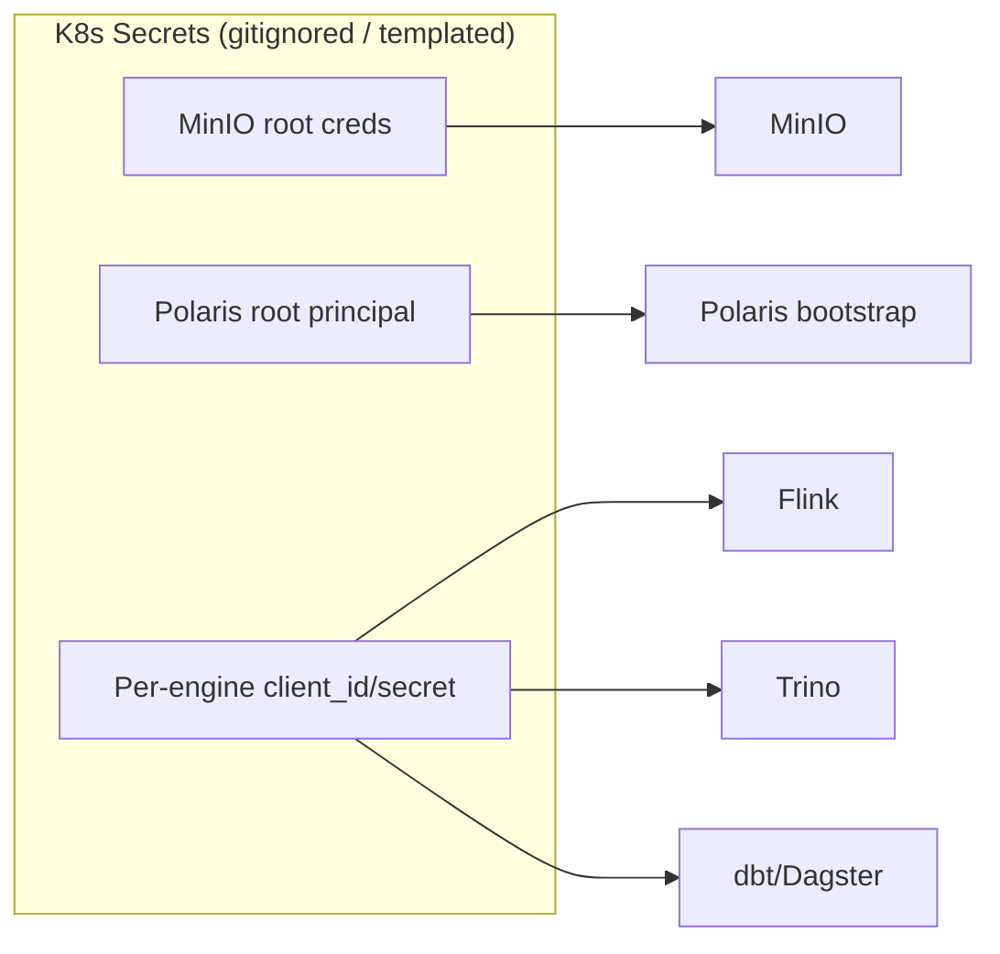

# 04 — Governance & Security Architecture

The defining feature of "Blueprint A" is **governed access**: engines never hold
long-lived MinIO keys. They authenticate to Apache Polaris (the Iceberg REST
catalog) over OAuth2 client-credentials and receive *scoped, temporary* storage
credentials — the pattern known as **credential vending**.

## Trust model

### The flow, step by step

1. Each engine is issued a **principal** (`client_id` / `client_secret`),
   delivered as a Kubernetes Secret — never committed in plaintext.
2. The engine exchanges those credentials at the Polaris **OAuth2 token
   endpoint** (client-credentials grant) for a short-lived access token.
3. The engine calls the **Iceberg REST API** with that token to resolve table
   metadata (current snapshot, manifest locations).
4. Polaris checks **RBAC grants** and, for permitted operations, **vends scoped,
   temporary S3 credentials** (STS-style or configured static) alongside the
   metadata.
5. The engine reads/writes the actual Parquet objects in MinIO using those
   temporary credentials — bounded to exactly the catalog's storage location.

## Sequence: Trino reads a table (read-only principal)

## RBAC posture — least privilege per engine

Principals are granted only what their role in the pipeline requires:

| Principal | Role | Catalog grants | Rationale |
| :--- | :--- | :--- | :--- |
| Flink | writer | create/write on raw namespace | first + only writer of the raw table |
| Trino (BI/interactive) | reader | read on all namespaces | pure read engine; must not mutate tables |
| dbt | writer | create/write on silver + gold namespaces | materializes new transform tables |
| Maintenance jobs | writer/admin | write + metadata ops on maintained tables | commits compaction/expiry through the catalog |

## Where secrets live

- No credentials are committed in `values.yaml` — they are injected via Secrets
  or env, with placeholders in the repo.
- The **Polaris root principal** is bootstrapped once (realm bootstrap) and used
  only to mint the per-engine principals; engines never use root.
- **Credential vending is the boundary of trust:** even if an engine token
  leaks, it is short-lived and scoped to one catalog's storage prefix.

## Security scope & non-goals (local blueprint)

This is a **local, single-cluster blueprint**, so the following are explicitly
out of scope:

- **TLS / mTLS** between components — traffic is in-cluster plaintext.
- **Production identity provider** — OAuth2 is Polaris-internal client-credentials,
  not federated SSO.
- **Network policies / service mesh** — not enforced.
- **Data encryption at rest** beyond whatever MinIO/host provides.

The architecture is *shaped* for these to be added (every engine already goes
through OAuth2 + vending), but hardening is a follow-on, not part of the blueprint.
