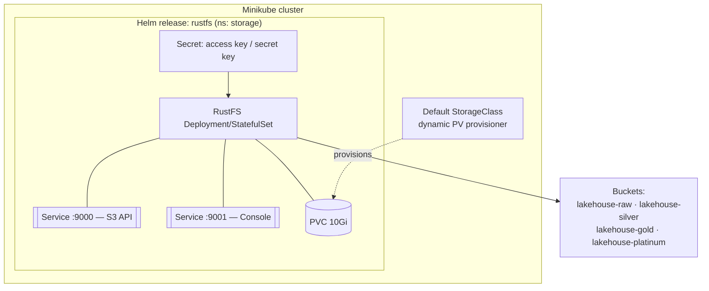
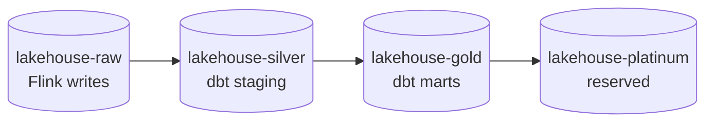

# LLD 01 — Foundation & Storage Substrate

**Layer:** Kubernetes + S3 storage

## Purpose & scope

Provision the local Kubernetes cluster and the S3-compatible object store that
every later layer builds on. **In scope:** cluster, default StorageClass, Helm
tooling baseline, RustFS with persistent storage, medallion buckets. **Out of
scope:** TLS, production hardening, any catalog or engine.

## Component internals

## Configuration contract

| Concern | Setting | Notes |
| :--- | :--- | :--- |
| Cluster | Minikube (default provider), `deploy/cluster/` | default StorageClass must exist for dynamic PVCs |
| Helm tooling | pinned chart versions, repo-add script | declarative install, no ad-hoc `--set` of structural config |
| RustFS deploy | RustFS Helm chart (`rustfs/rustfs`), `deploy/storage/` | pinned version |
| Deploy mode | **standalone — `replicaCount: 1`** | chart default is distributed (4 replicas); overridden to one pod/one PVC for the lean local profile |
| RustFS persistence | `storageclass.dataStorageSize=10Gi`, `storageclass.name` (default class) | single lean PVC |
| Resources | requests `cpu 100m / memory 128Mi`, limit `memory 512Mi` | Rust binary (~100MB) — far leaner than the Go-based predecessor |
| RustFS ports | S3 API `9000`, console `9001` | port-forward for host access |
| Credentials | `RUSTFS_ACCESS_KEY` / `RUSTFS_SECRET_KEY` via **Secret**/env (`secret.existingSecret`) | no plaintext in `values.yaml` (placeholder only); never ship the `rustfsadmin` default |
| Buckets | `lakehouse-raw/silver/gold/platinum` | created idempotently via aws-cli/boto3 (no `mc` client) |
| Addressing | **path-style** access required | `s3.path-style-access=true` for all clients (local, virtual-hosted-style not used) |

### Bucket layout (medallion)

## Durability model

RustFS's object data lives on a PVC provisioned by the default StorageClass, not
in the pod. The pod is therefore disposable: if it is deleted or rescheduled, the
PVC re-binds to the replacement and all objects remain intact. This is what lets
every layer above treat RustFS as durable storage.

## Inputs consumed / outputs produced

**Consumes:** nothing — this is the foundation layer.

**Produces — the foundation contract (to all layers above):**

- Running cluster + **default StorageClass** (dynamic PVCs).
- **Helm/deployment tooling baseline** (pinned repos, install targets).
- RustFS **internal endpoint** `rustfs.<ns>.svc.cluster.local:9000` + path-style
  requirement; external port-forward URL + console.
- The four **medallion buckets**.
- Root credential handling pattern (Secret/env, gitignored).

Target folders: `deploy/cluster/` (cluster provisioning + StorageClass baseline),
`deploy/storage/` (RustFS Helm values), `scripts/` (bucket creation).
