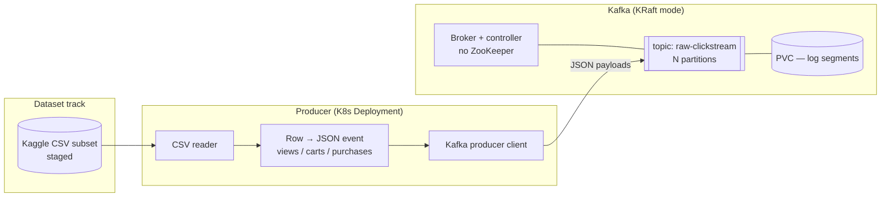
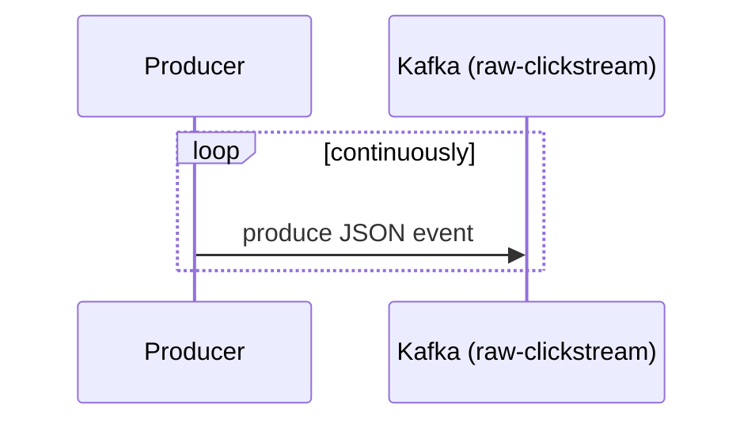

# LLD 02 — Real-Time Ingestion Backbone

**Layer:** Kafka + producer

## Purpose & scope

Stand up the streaming message backbone and simulate a production data stream by
replaying the Kaggle eCommerce clickstream into Kafka. **In scope:** Kafka
(KRaft) deploy, the `raw-clickstream` topic(s), dataset staging, a containerized
Python producer, and its K8s deployment. **Out of scope:** any consumer — the
[Flink job](04-stream-processing.md) is the first reader.

## Component internals

> **KRaft mode** = Kafka's built-in Raft quorum; no separate ZooKeeper. Broker
> and controller roles run in-process, simplifying the local deploy.

## Configuration contract

| Concern | Setting | Notes |
| :--- | :--- | :--- |
| Deploy | Kafka Helm chart, **KRaft** mode | pinned version, `deploy/ingestion/` |
| Bootstrap | `kafka.<ns>.svc.cluster.local:9092` | in-cluster DNS handed to Flink |
| Topic | `raw-clickstream`, partitions + replication | replication=1 acceptable locally |
| Persistence | PVC for log dirs | events survive broker restart |
| Producer image | containerized Python, source in `apps/clickstream-producer/` | built + pushed/loaded into cluster |
| Producer runtime | K8s Deployment, continuous replay | restart/backoff on completion to keep stream live |
| Event schema | JSON: `event_time`, `event_type`, `product_id`, `category`, `user_id`, `user_session`, price… | the **producer/consumer contract** |

## Event schema (the contract Flink parses)

The JSON payload mirrors the Kaggle columns — the canonical fields are the
clickstream essentials:

| Field | Type | Meaning |
| :--- | :--- | :--- |
| `event_time` | timestamp | event-time basis for Flink watermarks |
| `event_type` | string | `view` / `cart` / `purchase` |
| `product_id` | long | product identifier |
| `category_id` / `category_code` | long / string | product category |
| `brand` | string | brand (nullable) |
| `price` | decimal | unit price |
| `user_id` | long | customer identifier |
| `user_session` | string | session identifier (funnel grouping) |

> This field set is the shape the [Flink job](04-stream-processing.md)
> deserializes and the [dbt staging models](06-orchestration-transform.md)
> clean.

## Key sequence — continuous ingestion

The producer replays the staged CSV as a never-ending stream: on reaching the end
of the dataset it restarts, so the topic always carries live traffic rather than
a one-shot load.

## Inputs consumed / outputs produced

**Consumes (from the [foundation](01-foundation-storage.md)):** cluster,
StorageClass, Helm tooling.

**Produces — the ingestion contract (to [stream processing](04-stream-processing.md)):**

- Live **`raw-clickstream`** topic with a continuous event flow.
- In-cluster **bootstrap DNS** `kafka.<ns>.svc.cluster.local:9092`.
- The **JSON event schema** (producer/consumer contract).

Target folders: `deploy/ingestion/` (Kafka Helm values + topic creation, producer
Deployment), `apps/clickstream-producer/` (producer source + Dockerfile),
`scripts/` (dataset staging).
