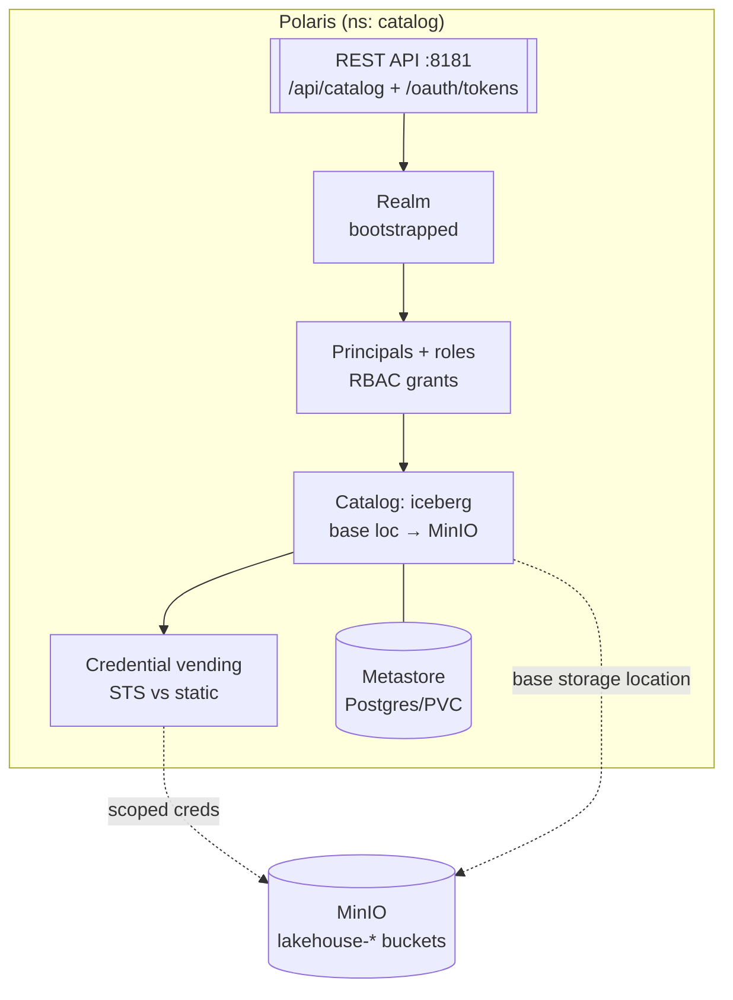
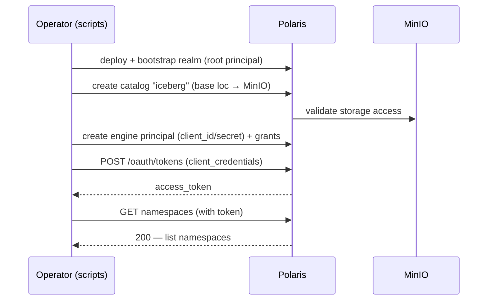
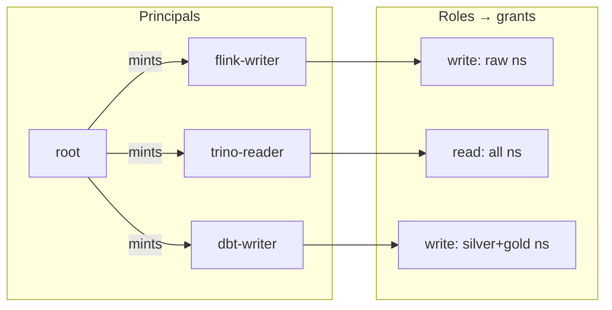

# LLD 03 — Governance & Catalog Layer

**Layer:** Apache Polaris (Iceberg REST Catalog)

## Purpose & scope

Stand up Apache Polaris as the Iceberg REST Catalog with explicit governance:
bootstrap a realm, create a MinIO-backed catalog, define RBAC, and enable
credential vending so downstream engines get scoped, temporary S3 access. **In
scope:** deploy + metastore, realm/root bootstrap, catalog creation, RBAC. **Out
of scope:** any writer or reader engine.

## Component internals

## Configuration contract

| Concern | Setting | Notes |
| :--- | :--- | :--- |
| Deploy | `deploy/catalog/`, pinned image | persistence backend (Postgres/PVC), not in-memory |
| REST endpoint | `polaris.<ns>.svc.cluster.local:8181/api/catalog` | in-cluster URI for engines |
| Token endpoint | OAuth2 **client-credentials** grant | `/oauth/tokens` (realm-scoped) |
| Realm | bootstrapped once, root principal | root only mints engine principals |
| Catalog | name `iceberg`, base storage → MinIO bucket prefix | path-style S3 |
| Vending mode | **STS** (temporary) vs **static** — decided here | the single most important downstream contract |
| RBAC | principals, roles, grants per namespace | least-privilege enforced |

## Key sequence — catalog bootstrap → first authenticated call

## RBAC model

## Inputs consumed / outputs produced

**Consumes (from the [foundation](01-foundation-storage.md)):** cluster,
StorageClass, Helm tooling, MinIO + `lakehouse-*` buckets. No dependency on the
ingestion layer.

**Produces — the catalog contract (to stream processing, compute, orchestration
and maintenance):**

- Iceberg REST catalog URI (`http://polaris.<ns>.svc.cluster.local:8181/api/catalog`).
- Realm name + OAuth2 token endpoint + client-credentials flow.
- Per-engine `client_id`/`client_secret` (vended via Secret).
- Catalog name (`iceberg`), its MinIO base storage location.
- **Credential-vending mode** (STS vs static) — how engines get scoped S3 creds.

Target folders: `deploy/catalog/` (Helm values / manifests + metastore),
`scripts/` (idempotent bootstrap/RBAC).
