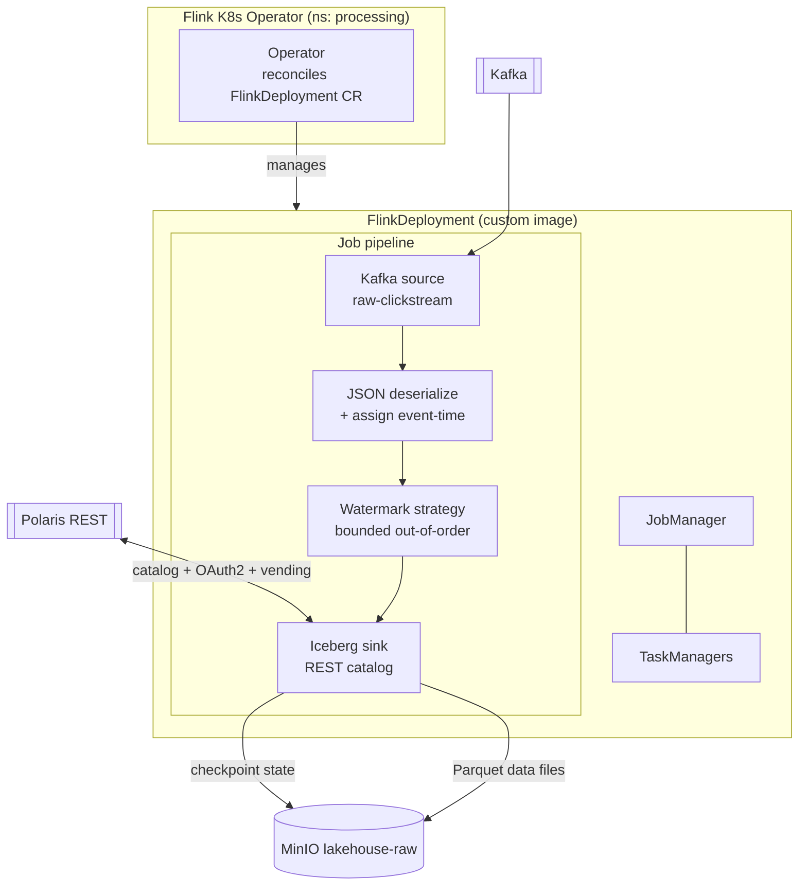
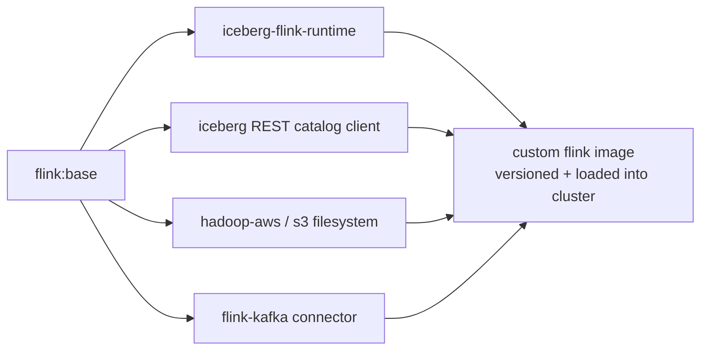
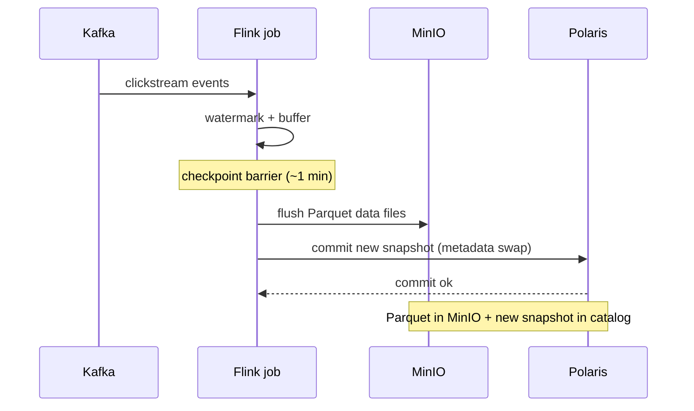

# LLD 04 — Stateful Stream Processing & Iceberg Integration

**Layer:** Apache Flink → Iceberg

## Purpose & scope

Deploy Flink to consume `raw-clickstream`, apply event-time + watermarks, and
write Parquet to MinIO — committing one Iceberg snapshot through Polaris on every
successful checkpoint. Flink is the **first and only writer** of the raw table.
**In scope:** Flink Operator, a custom image (Iceberg + REST + S3 + Kafka jars),
catalog/table wiring, the job, checkpointing, deploy.

## Component internals

## The custom image

Vanilla Flink cannot talk to an Iceberg REST catalog on MinIO out of the box —
the required connectors are not on its classpath. A custom image bakes them in:

## Configuration contract

| Concern | Setting | Notes |
| :--- | :--- | :--- |
| Operator | Flink K8s Operator, `deploy/processing/` | manages `FlinkDeployment` CRs |
| Image | custom `Dockerfile` in `apps/flink-jobs/` | Iceberg + REST + S3 + Kafka jars, pinned |
| Catalog | type `rest`, URI → Polaris, OAuth2 client-credentials | vending mode per the [catalog contract](03-governance-catalog.md) |
| S3 filesystem | endpoint → MinIO, **path-style**, vended creds | `s3.path-style-access=true` |
| Source | Kafka `raw-clickstream`, JSON format | schema per the [ingestion contract](02-ingestion-backbone.md) |
| Time semantics | event-time from `event_time`, watermarks | bounded out-of-orderness |
| Checkpointing | interval ~1 min, state backend → MinIO/S3 | **checkpoint = 1 Iceberg snapshot** |
| Table | `iceberg.<ns>.<table>` + schema + partition spec | defined via DDL |
| Write props | Iceberg format version, target file size, distribution mode | drives the [small-file surface](07-day-two-operations.md) |

## Key sequence — checkpoint drives snapshot commit

## Inputs consumed / outputs produced

**Consumes:** the [catalog contract](03-governance-catalog.md) (REST URI,
OAuth2 client, vending mode); the [ingestion contract](02-ingestion-backbone.md)
(topic, JSON schema, bootstrap DNS); the
[foundation](01-foundation-storage.md) (cluster, StorageClass, Helm).

**Produces — the table contract (to compute, orchestration and maintenance):**

- **Table identifier** `<catalog>.<namespace>.<table>`, schema, partition spec —
  the stable shape Trino and dbt read.
- **Commit cadence** (one snapshot per checkpoint) and the resulting **small-file
  behavior** — the direct input to [day-two operations](07-day-two-operations.md).
- **Write properties** (format version, target file size, distribution mode) and
  delivery guarantees.
- How the custom image is built, versioned, and loaded.

Target folders: `deploy/processing/` (operator + `FlinkDeployment`),
`apps/flink-jobs/` (job source + custom image), `scripts/`.
