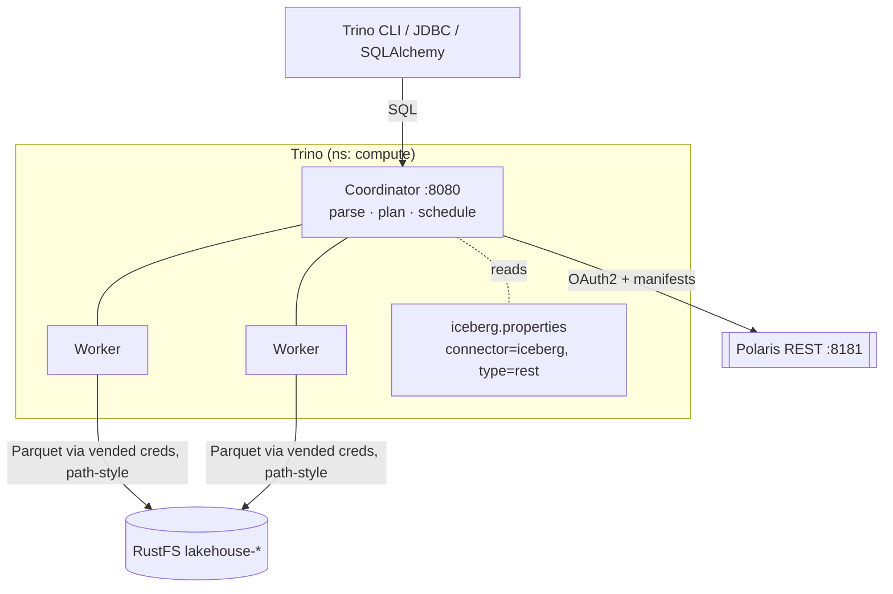
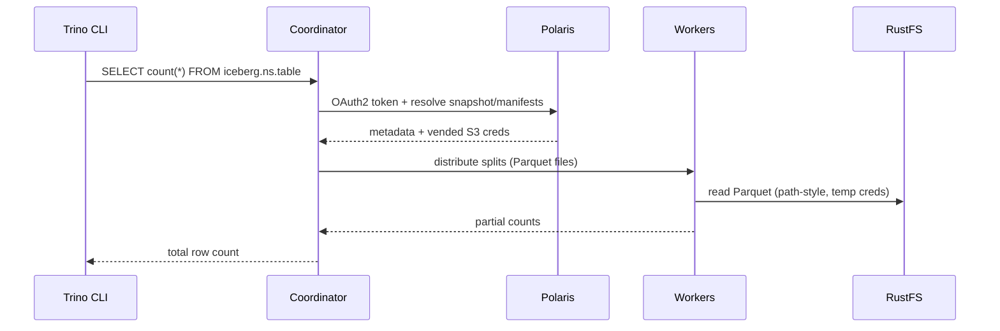

# LLD 05 — Distributed Compute Engine

**Layer:** Trino

## Purpose & scope

Deploy Trino as the parallel SQL engine that reads the Iceberg tables Flink
writes — loading manifests from Polaris over OAuth2 and pulling Parquet directly
from RustFS with vended credentials. Trino is a **pure reader** at this layer; it
does not create or write tables. **In scope:** Helm deploy (coordinator +
workers), the Iceberg REST catalog connector, OAuth2 + S3 wiring, CLI/client
access.

## Component internals

## Configuration contract — `iceberg.properties`

The catalog connector file is the heart of this layer:

| Property | Value | Notes |
| :--- | :--- | :--- |
| `connector.name` | `iceberg` | — |
| `iceberg.catalog.type` | `rest` | REST catalog, not Hive/Glue |
| `iceberg.rest-catalog.uri` | `http://polaris.<ns>.svc.cluster.local:8181/api/catalog` | per the [catalog contract](03-governance-catalog.md) |
| `iceberg.rest-catalog.security` | `OAUTH2` | client-credentials |
| `iceberg.rest-catalog.oauth2.*` | client_id / client_secret / token endpoint | from Secret |
| `iceberg.rest-catalog.vended-credentials-enabled` | `true` | consume Polaris-vended S3 creds |
| `fs.native-s3.enabled` / `s3.*` | RustFS endpoint, **path-style**, region | `s3.path-style-access=true` |

> **Both halves are required.** Pointing the connector at the REST catalog is not
> sufficient on its own: table *metadata* resolves via the REST identity, but
> table *data* only loads once OAuth2 and S3 file access are also wired. A
> connector with only the former will list tables and then fail to read them.

## Deployment shape

| Concern | Setting | Notes |
| :--- | :--- | :--- |
| Deploy | Trino Helm chart, `deploy/query/` | pinned version |
| Topology | 1 coordinator + N workers | scale workers for parallelism |
| Endpoint | `trino.<ns>.svc.cluster.local:8080` | in-cluster DNS |
| Catalog mount | `iceberg.properties` as config/ConfigMap | mounted into coordinator + workers |
| Client access | Trino CLI (port-forward), JDBC, SQLAlchemy-Trino | auth posture / `--user` documented |

## Key sequence — a distributed read

The coordinator resolves metadata once, then fans the Parquet files out as splits
across workers — each worker reads directly from RustFS with the vended
credentials, so data never flows back through Polaris.

## Inputs consumed / outputs produced

**Consumes:** the [catalog contract](03-governance-catalog.md) (REST URI,
OAuth2, vending); the [table contract](04-stream-processing.md) (table id,
schema, partition spec); the [foundation](01-foundation-storage.md) baseline.

**Produces — the Trino connection contract (to orchestration and BI):**

- **Connection contract:** coordinator host/port (in-cluster DNS + local
  port-forward), catalog name `iceberg`, default user/auth posture, and the
  JDBC / SQLAlchemy-Trino connection-string shapes.
- **Read contract:** visible namespaces/tables, vending behavior for a read-only
  engine, session defaults (catalog/schema).
- How Trino is deployed, versioned, and scaled (coordinator + worker count).

Target folders: `deploy/query/` (Helm values + `iceberg.properties`),
`scripts/` (validation queries).
