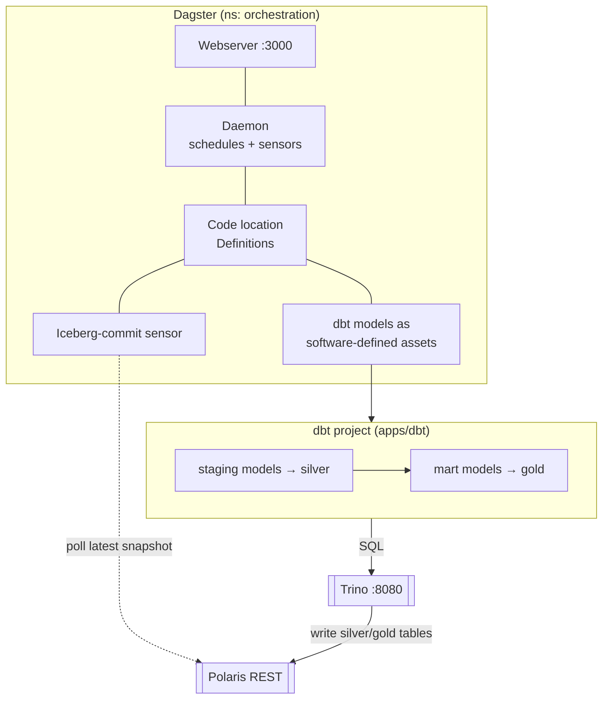
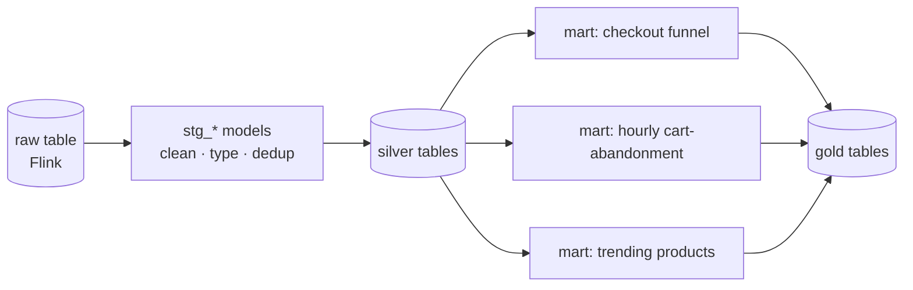
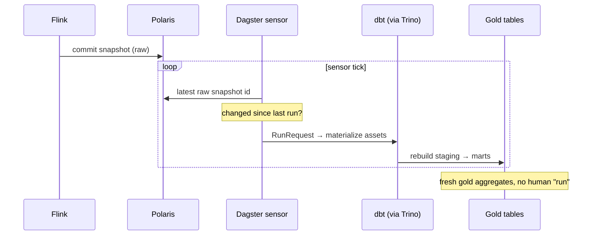

# LLD 06 — Asset-Driven Orchestration & Transformation

**Layer:** Dagster + dbt (`dbt-trino`)

## Purpose & scope

Deploy Dagster as orchestrator and dbt (`dbt-trino`) as the transform layer,
turning the raw streaming table into clean **silver** and aggregate **gold**
models — and make them **auto-materialize** when new data lands via an
event-driven sensor watching Iceberg commits. Unlike the read-only compute layer,
dbt **writes** tables, so its principal needs create/write grants. **In scope:**
Dagster deploy, dbt project + adapter, staging + mart models,
dbt-as-Dagster-assets, the sensor.

## Component internals

## The transform graph (medallion)

## Configuration contract

| Concern | Setting | Notes |
| :--- | :--- | :--- |
| Dagster deploy | Helm, `deploy/orchestration/` | webserver + daemon + run/event storage |
| dbt adapter | `dbt-trino` | profile → [Trino connection contract](05-compute-engine.md) |
| dbt target | catalog `iceberg`, silver/gold schemas | writes to `lakehouse-silver/gold` |
| Write grants | dbt principal: create/write on silver+gold ns | from the [catalog RBAC model](03-governance-catalog.md) |
| Materialization | staging (table/incremental), marts (table/incremental) | incremental adds snapshots → [maintenance surface](07-day-two-operations.md) |
| Assets | dbt models loaded as SDAs | one Dagster asset per dbt model |
| Sensor | watches Iceberg **commit signal** on raw table | keys off Flink's per-checkpoint snapshot |

## Key sequence — event-driven auto-materialization

The sensor keys off the snapshot id rather than a clock, so transforms run
exactly as often as data actually lands — no polling schedule to tune, and no
empty runs between checkpoints.

## Inputs consumed / outputs produced

**Consumes:** the [Trino connection contract](05-compute-engine.md); the
[table contract](04-stream-processing.md) + commit cadence (the sensor signal);
[write grants](03-governance-catalog.md); the
[foundation](01-foundation-storage.md) baseline + buckets.

**Produces — model/orchestration contracts (to maintenance and BI):**

- **Model/table contract:** the gold (and silver) tables — identifiers, grains,
  key columns, materialization strategy, refresh semantics.
- **New compaction surface:** additional Iceberg tables + incremental snapshots —
  input to the [maintenance scope](07-day-two-operations.md) alongside Flink's
  raw table.
- **Orchestration contract:** which assets/jobs exist, what the sensor watches
  and triggers, how to run/observe a materialization.

Target folders: `deploy/orchestration/` (Helm values), `apps/dagster/` (code
location, sensor, asset definitions), `apps/dbt/` (dbt project, models,
`profiles.yml`), `scripts/`.
