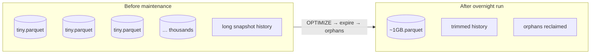
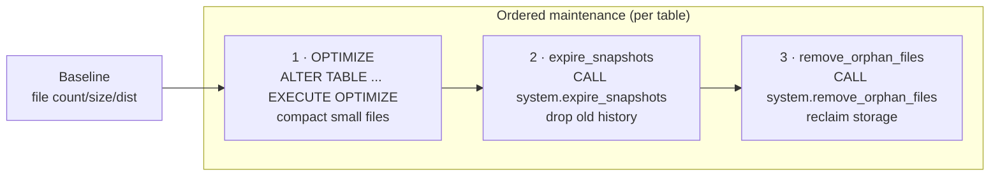
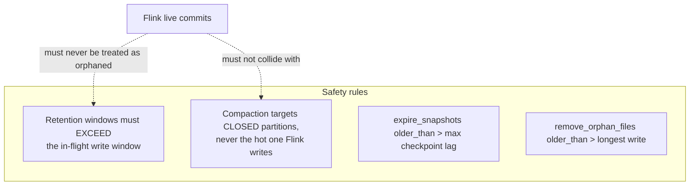
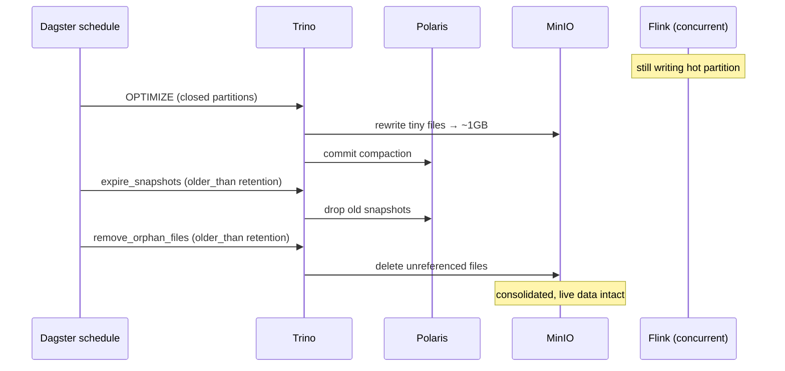

# LLD 07 — Day-Two Operations & Automated Maintenance

**Layer:** Trino SQL + scheduled Dagster jobs

## Purpose & scope

Fix the **small-file problem**: Flink commits a snapshot per checkpoint (~1/min)
and dbt incremental models append per sensor run — together producing thousands
of tiny Parquet files and an ever-growing snapshot history. Trino maintenance SQL
wrapped in **scheduled Dagster jobs** lets the lakehouse maintain itself
overnight — safely, while **Flink keeps writing**. **In scope:**
baseline/measurement, compaction SQL, expiration + orphan-removal SQL, Dagster
scheduling.

## The problem being solved

## Maintenance operations & order

**Why this order:** compaction *creates* new files and orphans old ones →
expiring snapshots releases references to superseded files → orphan removal then
physically reclaims anything no longer referenced. Running orphan removal first
would miss what compaction is about to orphan.

## Safety model — maintenance vs. a live writer

This is the central, non-obvious constraint of this layer: **Flink is writing the
whole time.** Maintenance never gets a quiet window to work in, so every
operation must be safe against concurrent commits.

## Configuration contract

| Concern | Setting | Notes |
| :--- | :--- | :--- |
| SQL location | `sql/` | compaction / expiration / orphan SQL |
| Execution engine | **[Trino](05-compute-engine.md)** | `ALTER TABLE ... EXECUTE OPTIMIZE`, `CALL system.*` |
| Scheduler | **[Dagster](06-orchestration-transform.md)** jobs/schedules | siblings/extension of the code location |
| Target file size | ~1GB (per [Flink write props](04-stream-processing.md)) | compaction target |
| Snapshot retention | `older_than` > max in-flight write window | safety constraint |
| Orphan retention | `older_than` > longest write | safety constraint |
| Scope | Flink raw table + dbt incremental silver/gold | whole maintained table set |
| Grants | maintenance principal: write + metadata ops | commits through Polaris |

## Key sequence — overnight consolidation

## Inputs consumed / outputs produced

**Consumes:** the [commit cadence + live-writer constraint](04-stream-processing.md);
[Trino](05-compute-engine.md) as executor; the
[Dagster scheduler + dbt tables](06-orchestration-transform.md);
[catalog grants](03-governance-catalog.md); [MinIO](01-foundation-storage.md).

**Produces — the maintenance contract (to BI and operators):**

- **Schedule & cadence** per table (when OPTIMIZE / expire / orphan-removal run),
  target file size, retention windows.
- **Safety rules** for running against the live Flink writer.
- The **operation order** (compact → expire → orphans) and why.

Target folders: `sql/` (the maintenance SQL itself), `deploy/maintenance/`
(schedule manifests / Helm values), `apps/dagster/` (the jobs + schedules that
execute the SQL, alongside the transform code location), `scripts/`
(measurement).
