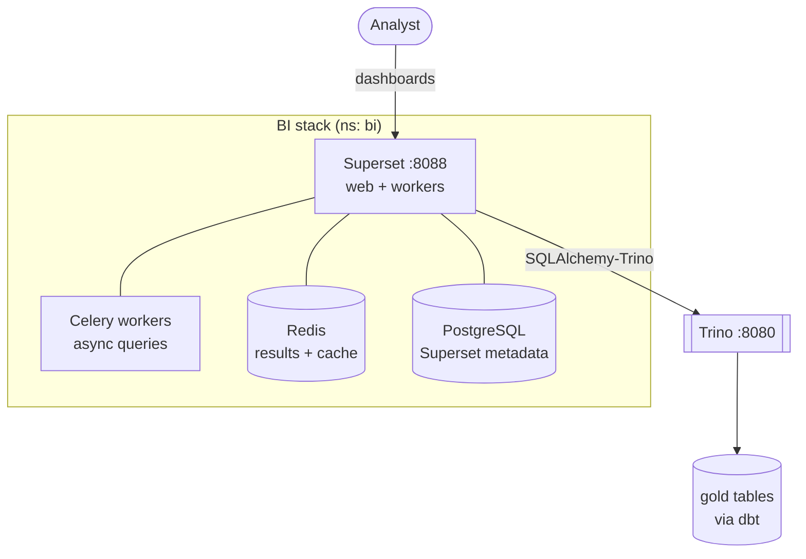
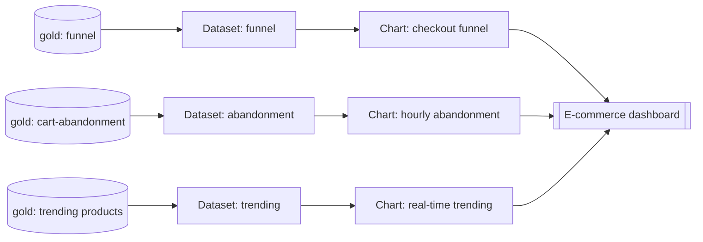
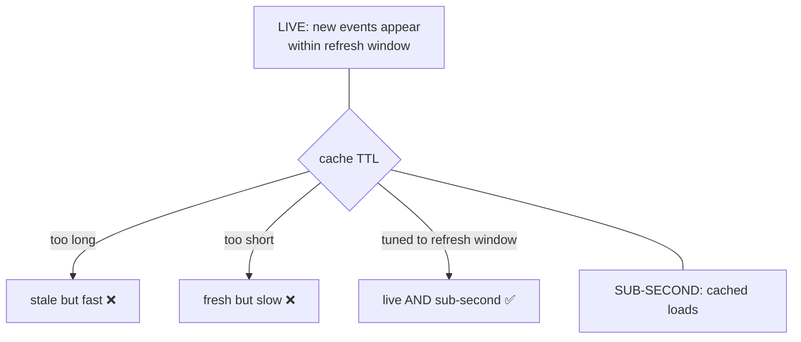
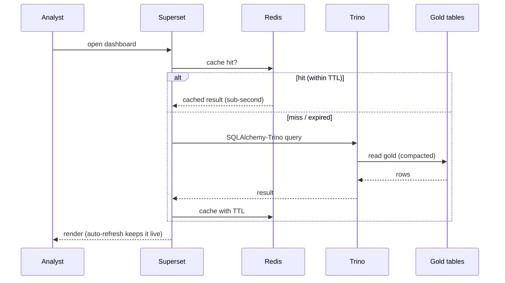

# LLD 08 — Business Intelligence & Visualization

**Layer:** Superset + Redis + PostgreSQL

## Purpose & scope

Deploy Apache Superset (with Redis caching + a PostgreSQL metadata store) and put
**interactive, high-performance dashboards** on the governed dbt gold tables,
served through Trino. Superset **consumes** dbt-owned metrics — it does not
re-implement business logic. **In scope:** stack deploy, Trino connection,
dataset/semantic layer, charts + dashboard, caching + auto-refresh, whole-stack
runbook.

## Component internals

## Configuration contract

| Concern | Setting | Notes |
| :--- | :--- | :--- |
| Deploy | Superset Helm chart, `deploy/bi/` | Superset + Redis + Postgres |
| Metadata DB | PostgreSQL + PVC | dashboards/datasets/users persist |
| Cache/results | Redis | cache backend + Celery results |
| Driver | `sqlalchemy-trino` baked into image | how the dialect reaches Superset |
| Connection | `trino://<user>@trino.<ns>.svc.cluster.local:8080/iceberg` | per the [Trino connection contract](05-compute-engine.md) |
| Config overrides | `SECRET_KEY`, cache config, Celery | via committed Superset config |
| Datasets | registered on **gold** tables | semantic layer references dbt metrics |
| Refresh | dashboard auto-refresh window | tuned vs. cache TTL |

## Dashboard semantic layer

> Superset datasets map 1:1 to dbt gold tables; metrics are **precomputed by
> dbt**, so Superset does not redefine business logic (no metric drift).

## The freshness ↔ performance reconciliation

The dashboard must hold **both** properties at once. Redis caches query results;
the cache TTL is tuned to the dashboard auto-refresh window — short enough that
new gold data (arriving via the live ingest → process → transform chain) surfaces
within the window, long enough that repeated loads stay sub-second.
[Compaction](07-day-two-operations.md) is what keeps the underlying gold-table
queries fast enough for this to hold over time.

## Key sequence — live dashboard load

## Inputs consumed / outputs produced

**Consumes:** the [Trino connection contract](05-compute-engine.md); the
[gold model/metric contract](06-orchestration-transform.md);
[performance guarantees](07-day-two-operations.md) (compacted tables); the
[foundation](01-foundation-storage.md) baseline + Postgres PVC; the live chain
from [ingestion](02-ingestion-backbone.md) through
[stream processing](04-stream-processing.md) to
[transforms](06-orchestration-transform.md).

**Produces / owns:** the presentation layer — datasets, charts, the dashboard,
the caching/refresh posture, and the **whole-stack runbook** (zero → live
dashboard) that ties every layer together. Nothing consumes this layer; it is the
end of the line.

Target folders: `deploy/bi/` (Helm values, Superset config, and exported
dashboard/dataset assets), `scripts/`.
